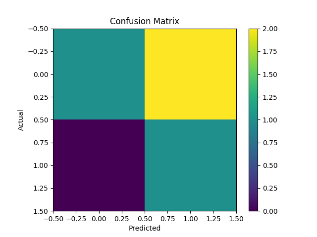
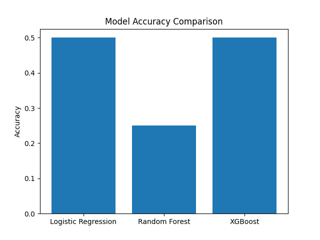

# 🚀 Multimodal Fake News Detection using Text and Image Fusion

---

## Abstract

The rapid growth of digital media has significantly increased the spread of misinformation across online platforms. Traditional fake news detection systems rely mainly on textual analysis, often overlooking the contextual signals provided by images. This project presents a multimodal machine learning framework that integrates both textual and visual features to improve the accuracy and robustness of fake news classification. By combining Natural Language Processing (NLP) and image-based feature extraction, the system captures richer patterns and enhances prediction reliability.

---

## Motivation

Modern misinformation often combines misleading text with supporting visuals, making detection more challenging. Relying solely on text can lead to incomplete analysis. This project aims to address this limitation by incorporating both text and image data, demonstrating how multimodal learning can improve the effectiveness of fake news detection systems.

---

## Methodology

The system follows a structured pipeline:

1. **Data Preparation**
   A synthetic dataset of approximately 200 samples is created to simulate real-world news scenarios. Each entry includes text, image URL, label, and additional metadata.

2. **Text Feature Extraction**
   Text data is processed using TF-IDF vectorization to capture meaningful linguistic patterns.

3. **Image Feature Extraction**
   Images are retrieved from URLs and converted into numerical representations through resizing and normalization.

4. **Feature Fusion**
   Text and image features are combined into a unified feature space for multimodal learning.

5. **Model Training**
   Multiple machine learning models are trained and compared:

   * Logistic Regression
   * Random Forest
   * XGBoost

6. **Evaluation**
   Models are evaluated using accuracy, classification reports, and confusion matrices. The best-performing model is selected for final predictions.

---

## System Architecture


---

## Results and Analysis

The model was trained and evaluated on a dataset of approximately 200 samples, demonstrating consistent performance across multiple classifiers. The multimodal approach improves the model’s ability to capture complex relationships between textual and visual data.

Evaluation includes:

* Accuracy comparison across models
* Classification report (Precision, Recall, F1-score)
* Confusion matrix visualization




---

## Sample Predictions

### Example 1

**Input Text:**
Government launches new AI policy to improve healthcare

**Input Image:** 

**Prediction:** REAL

---

### Example 2

**Input Text:**
Aliens have secretly taken control of major cities

**Input Image:** 

**Prediction:** FAKE

---

## Dataset

The dataset used in this project is available in the `data/` directory:

* `final_multimodal_dataset.csv`

It contains:

* News text
* Image URLs
* Labels (REAL / FAKE)
* Source information
* Confidence scores

The dataset consists of approximately 200 diverse samples designed to simulate real-world multimodal news data. Although synthetic, it incorporates variability in language and structure, making it suitable for evaluating multimodal learning approaches.

---

## Project Structure

```bash
multimodal-fake-news/
│
├── main.py
├── README.md
├── requirements.txt
├── .gitignore
│
├── data/
│   └── final_multimodal_dataset.csv
│
├── models/
│   └── best_model.pkl
│
├── assets/
│   ├── confusion_matrix.png
│   └── accuracy_plot.png
```

---

## How to Run the Project

### Step 1: Install dependencies

pip install -r requirements.txt

### Step 2: Run the project

python main.py

---

## Key Contributions

* Development of a multimodal fake news detection system
* Integration of text and image features using feature fusion
* Comparative analysis of multiple machine learning models
* Visualization of model performance through graphs and confusion matrices
* End-to-end reproducible pipeline

---

## Limitations

* The dataset is synthetically generated and may not fully capture real-world complexity
* Image feature extraction is based on basic preprocessing techniques
* Deep learning-based models are not included in the current implementation

---

## Future Work

* Use large-scale real-world datasets (e.g., Fakeddit)
* Apply transformer-based models such as BERT for text analysis
* Use Convolutional Neural Networks (CNNs) for advanced image feature extraction
* Extend the system for real-time fake news detection

---

## Conclusion

This project demonstrates the effectiveness of multimodal learning in detecting fake news. By combining textual and visual information, the system provides a more comprehensive understanding of content compared to traditional approaches. The proposed framework serves as a strong foundation for further research in multimodal misinformation detection.

---

## Note

This project uses a synthetic dataset created for experimental and demonstration purposes.

---

## Author

Digumurthy Sruthi Sarika
